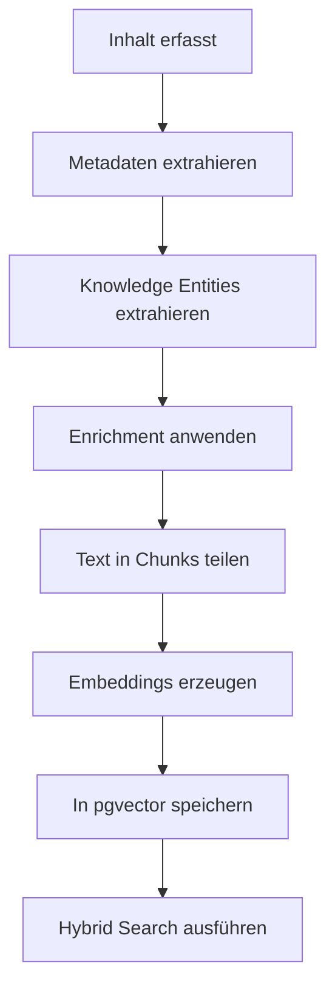

## Überblick

Brainz integriert KI nicht als isolierten Chat, sondern als durchgehende Intelligenzschicht für Wissensmanagement, Suche, Anreicherung und Automatisierung. Dazu gehören semantische Suche auf Basis von `pgvector`, automatische Inhaltsanalyse, tägliche Briefings, Extraktion von Knowledge Entities und eine Tag-Intelligence-Pipeline, die Begriffe konsolidiert und Beziehungen erkennt.

Alle KI-Aufgaben laufen über eine zentrale AI Service Registry. Diese Registry unterstützt mehrere Provider, darunter OpenAI, Anthropic, Google und lokale OpenAI-kompatible Endpunkte wie Ollama, erfasst Kosten pro Modell und erlaubt task-spezifisches Routing ohne Codeänderungen.

<Callout kind="info">

Brainz trennt Aufgaben bewusst nach Workload. Der KI-Assistent verwendet standardmäßig `openai/gpt-5-mini`, während Hintergrundaufgaben wie Vision, Entity-Extraktion, Tag-Intelligence oder Briefings auf spezialisierte Modelle und Services verteilt werden.

</Callout>

## KI-Assistent

Der KI-Assistent liefert LLM-basierte Antworten per SSE-Streaming, sodass Ausgaben in Echtzeit im UI erscheinen. Er ist nicht nur für Textantworten zuständig, sondern kann Werkzeuge aufrufen, Daten lesen und schreiben, Web-Suchen ausführen und Navigationsaktionen im Interface anstoßen.

Tool Calling läuft pro Anfrage in bis zu sechs Runden und unterstützt parallele Ausführung. Dadurch kann der Assistent mehrere Informationen zusammenführen, bevor er eine endgültige Antwort formuliert.

### Was der Assistent im Kontext berücksichtigt

Der Assistent injiziert kontextbezogene Informationen direkt in den Prompt. Dazu gehören gepinnte Entitäten, Knowledge Entities, ein Workspace-Snapshot, Standortinformationen und prädiktive Hinweise auf naheliegende nächste Aktionen.

Zusätzlich kann Brainz externe MCP-Tools dynamisch laden. Dadurch lässt sich der Assistent um weitere Werkzeuge erweitern, ohne die Kernlogik des Chats umzubauen.

### Fähigkeiten des Assistenten

- **SSE-Streaming** für tokenweise Echtzeit-Antworten
- **Tool Calling** mit bis zu 6 Runden pro Request
- **Parallele Tool-Ausführung** für kombinierte Abfragen
- **Web-Suche** über Brave Search
- **Intent Engine** für Datenbankoperationen und UI-Navigation
- **Budget-Kontrolle** über tägliche Token- und Request-Limits
- **MCP-Integration** für externe Tools
- **Secret Redaction** vor dem Versand sensibler Inhalte an das Modell
- **Konfigurierbares Standardmodell**, standardmäßig `openai/gpt-5-mini`

```bash
AI_ASSISTANT_MODEL=openai/gpt-5-mini
AI_BASE_URL=https://gateway.ai.cloudflare.com/v1/acme-account/brainz-gateway
```

<Callout kind="tip">

Wenn ein Modell rohe Tool-Call-Ausgaben oder JSON-Fragmente zurückliefert, filtert Brainz solche Leaks vor der Anzeige. Das hält Chat-Antworten nutzbar, auch wenn intern mehrere Tool-Runden stattfinden.

</Callout>

## Embeddings und semantische Suche

Brainz speichert Vektoren in PostgreSQL mit `pgvector`. Die Suchpipeline kombiniert semantische Ähnlichkeit mit klassischer Volltextsuche und unscharfer Suche, damit nicht nur exakt passende Begriffe, sondern auch inhaltlich ähnliche Dokumente gefunden werden.

Vor dem Embedding durchläuft Inhalt mehrere Verarbeitungsschritte. Diese Pipeline sorgt dafür, dass nicht nur Textvektoren entstehen, sondern auch strukturierte Metadaten, Entitäten und zusätzliche Kontextsignale im Suchindex landen.

### Pipeline für semantische Anreicherung



### Technische Details

- **Vektor-Storage** in PostgreSQL mit `pgvector`
- **Multi-Stage Pipeline**: Metadaten, Knowledge Entities, Enrichment, Chunked Embeddings, Vector Storage
- **Chunking** mit 300 bis 500 Tokens pro Chunk
- **Overlap** von 50 Tokens zwischen benachbarten Chunks
- **Embedding-Modell** `openai/text-embedding-3-small`
- **Vektordimension** 1024
- **Content-Hash-Deduplizierung**, damit unveränderte Inhalte nicht neu eingebettet werden
- **Hybrid Search** aus `tsvector`, semantischer Ähnlichkeit und Fuzzy-Matching

<Callout kind="info">

Klassische Volltextsuche findet vor allem identische oder sprachlich sehr ähnliche Begriffe. Semantische Suche findet auch konzeptuelle Übereinstimmungen, selbst wenn die exakten Wörter im Dokument nicht vorkommen.

</Callout>

## Vision Intelligence

Vision Intelligence analysiert Bilder und PDFs automatisch und extrahiert strukturierte Informationen aus visuellen Inhalten. Das ist für Screenshots, Fotos, Belege, Visitenkarten, Whiteboards und gescannte Dokumente relevant.

Für PDFs verwendet Brainz drei Strategien in definierter Reihenfolge: gerenderte Seitenbilder, native PDF-Verarbeitung und Text-Extraktion als Fallback. So bleibt die Analyse auch dann funktionsfähig, wenn ein PDF visuell komplex oder textuell unvollständig ist.

### Was Vision extrahiert

- **Daten und Termine**
- **Kontakte und Namen**
- **Beträge und Referenznummern**
- **Orte und Adressen**
- **Textinhalte**
- **Kategorien**
- **Action Items**

Brainz kann aus erkannten Datumsangaben automatisch Erinnerungen erzeugen. Zusätzlich wird der Inhaltstyp bei ausreichend hoher Sicherheit angehoben, zum Beispiel von Bild zu Rechnung, Rezept oder anderer spezifischer Dokumentklasse.

### Weitere Funktionen

- **Schema.org-Ausgabe** aus Vision-Ergebnissen
- **Geocoding** für extrahierte Adressen
- **Bildvorverarbeitung** mit Größen- und Qualitätsoptimierung
- **Standardmodell** `openai/gpt-4.1-mini`

## Audio-Transkription

Die Audio-Pipeline transkribiert Sprachaufnahmen und analysiert den Inhalt im Anschluss mit einem zweiten Modellschritt. Dadurch endet der Prozess nicht bei Rohtext, sondern erzeugt strukturierte Informationen, Dokumente und Erinnerungen.

Brainz erkennt die Herkunft einer Aufnahme automatisch, etwa aus WhatsApp, Telegram, Signal, iMessage, Zoom oder Teams. Diese Quell-App fließt in die weitere Interpretation des Inhalts ein.

### Pipeline und Grenzen

- **Speech-to-Text** mit `openai/whisper-1`
- **Quell-App-Erkennung** für Messenger, Voice-Memos und Meeting-Tools
- **LLM-Analyse** für Titel, Zusammenfassung, Themen, Action Items, Termine, Kontakte und Stimmung
- **Automatische Dokument-Erstellung** aus der Transkription
- **Auto-Reminder** für erkannte Termine
- **Maximale Dateigröße** 25 MB
- **Timeout** 120 Sekunden
- **Standardmodell für STT** `openai/whisper-1`

<Callout kind="alert">

Audio über der Whisper-Grenze von 25 MB wird nicht verarbeitet. Für lange Aufnahmen ist Vorverarbeitung oder Segmentierung sinnvoll, bevor die Datei in Brainz importiert wird.

</Callout>

## Tägliches Briefing

Das tägliche Briefing verdichtet persönliche Aktivität in kurze, narrative Zusammenfassungen. Tägliche Briefings bestehen aus zwei bis drei Sätzen, wöchentliche Rückblicke aus drei bis fünf Sätzen.

Die Generierung basiert auf mehreren Signalquellen, nicht nur auf einzelnen Dokumenten. Dazu gehören Tracking Events, geplante Aktionen, Insights, Themencluster, Kalenderdaten, Knowledge Entities, Medienkonsum und Kontaktaktivität.

### Eigenschaften des Briefings

- **Tägliche Zusammenfassung** mit 2 bis 3 Sätzen
- **Wöchentliche Zusammenfassung** mit 3 bis 5 Sätzen
- **Cooldown-Caching** mit 4 Stunden täglich und 24 Stunden wöchentlich
- **Persönlichkeit** mit warmer, konversationeller Tonalität, inspiriert von Samantha
- **Automatische Planung** um 7:00 Uhr
- **Persistenz als Dokument** mit eigenem Inhaltstyp

Wenn das LLM nicht verfügbar ist, kann Brainz auf ein Fallback-Briefing zurückgreifen. Dadurch bleibt die Funktion auch bei temporären Provider-Problemen nutzbar.

## Tag Intelligence

Tag Intelligence baut eine konsolidierte Tag-Taxonomie über mehrere Signale auf. Das Ziel ist nicht nur Dubletten zu erkennen, sondern Synonyme, Schreibvarianten und semantisch nahe Begriffe zusammenzuführen.

Die Pipeline arbeitet in mehreren Schichten. Erst wenn formale und semantische Signale nicht ausreichen, validiert ein LLM Grenzfälle und schlägt mögliche Hierarchien vor.

### Verwendete Signale

1. **Trigram-Ähnlichkeit** mit `pg_trgm` bei Schwelle `0.45` für Tippfehler und Abkürzungen
2. **Embedding-Ähnlichkeit** mit `pgvector` bei Schwelle `0.88` für semantische Synonyme
3. **Co-Occurrence** über Jaccard bei Schwelle `0.7` für Tags, die fast immer gemeinsam auftreten
4. **LLM-Validierung** für Grenzfälle und Hierarchievorschläge

### Ergebnisse der Pipeline

- **Automatisches Clustering** mit Union-Find
- **Kanonische Tags** pro Cluster
- **Hierarchie-Vorschläge** mit 8 bis 12 Gruppen
- **Regelmäßige Ausführung** alle 12 Stunden
- **Pflege von Usage-Statistiken** und Bereinigung veralteter Tags

## Knowledge Entities

Knowledge Entities bilden die strukturierte Wissensebene von Brainz. Das System erkennt Personen, Organisationen, Orte und Events und verknüpft diese Entitäten mit Inhalten, Erwähnungen und Kontextsignalen.

Die Architektur ist dreistufig aufgebaut. Globale Referenzdaten bilden die Basis, tenant-spezifische Entitäten ergänzen gemeinsam genutztes Wissen und user-spezifische Entitäten modellieren persönliche Beziehungen und Kontexte.

### Fähigkeiten des Entity-Systems

- **Automatische Erkennung** von `person`, `organization`, `place` und `event`
- **3-Tier-Architektur** von Global über Tenant zu User
- **Alias-System** für Spitznamen, Abkürzungen, formale Namen und weitere Varianten
- **KI-basierte Extraktion** aus Text
- **Direkte Regex-Erkennung** als ergänzender Scan
- **Entity Merge** mit Übernahme von Aliasen und Erwähnungen
- **Co-Occurrence Discovery** zwischen Entitäten
- **Insight-Generierung** für Zusammenhänge und Bestätigungsvorschläge
- **Geocoding** über Nominatim
- **Automatischer Wissensgraph-Aufbau** durch Verlinkung von Entitäten und Inhalten

<Callout kind="info">

Knowledge Entities sind nicht nur ein Extraktionsergebnis. Sie dienen auch als wiederverwendbarer Kontext für Suche, Assistent, Briefings und Anreicherungsprozesse.

</Callout>

## Provider-Konfiguration

Brainz verwendet das Format `provider/model-name` für Modell-IDs. Dadurch bleibt das Routing zwischen Providern konsistent, auch wenn mehrere Aufgaben unterschiedliche Modelle oder Endpunkte nutzen.

<Tabs>
  <Tab title="OpenAI" icon="code">

  OpenAI-Modelle werden typischerweise über Cloudflare AI Gateway angesprochen. Das gilt sowohl für Chat-Modelle als auch für Embeddings und Audio-Transkription.

  - **Modelle**: `openai/gpt-5-mini`, `openai/gpt-5`, `openai/gpt-4.1-mini`, `openai/gpt-4.1-nano`, `openai/gpt-4.1`
  - **Embeddings**: `openai/text-embedding-3-small`
  - **Audio**: `openai/whisper-1`

  ```bash
  AI_BASE_URL=https://gateway.ai.cloudflare.com/v1/acme-account/brainz-gateway
  CF_AIG_TOKEN=cf_aig_example_7k2mq9pr
  ```

  </Tab>
  <Tab title="Anthropic" icon="shield">

  Anthropic-Modelle können über denselben Gateway-Ansatz geroutet werden. Die Auswahl erfolgt über die Modell-ID, nicht über einen separaten Codepfad.

  - **Modelle**: `anthropic/claude-sonnet-4`, `anthropic/claude-3-5-haiku`
  - **Routing** über denselben Endpoint wie andere OpenAI-kompatible Provider
  - **Modell-ID-Format**: `anthropic/claude-sonnet-4`

  </Tab>
  <Tab title="Google / Ollama" icon="monitor">

  Google-Modelle und lokale Ollama-Modelle folgen demselben Routing-Prinzip. Für Ollama zeigt `AI_BASE_URL` auf den lokalen OpenAI-kompatiblen Endpoint.

  - **Google-Modelle**: `google-ai-studio/gemini-2.5-flash`, `google-ai-studio/gemini-2.5-pro`, `google-ai-studio/gemini-2.0-flash`
  - **Ollama**: beliebige lokal verfügbare Modelle über OpenAI-kompatiblen Endpoint

  ```bash
  AI_BASE_URL=http://localhost:11434/v1
  AI_ASSISTANT_MODEL=ollama/llama3
  ```

  </Tab>
</Tabs>

<Callout kind="tip">

Brainz nutzt das Format `provider/model-name`. Jede KI-Aufgabe kann über die Tabelle `ai_service_registry` individuell einem anderen Modell zugewiesen werden, ohne Codeänderungen am jeweiligen Feature.

</Callout>

<Callout kind="info">

Lokale Modelle über Ollama halten Daten im eigenen Netzwerkpfad. Das ist sinnvoll, wenn Inhalte das System nicht an externe APIs verlassen sollen oder wenn mit internen Compliance-Vorgaben gearbeitet wird.

</Callout>

## AI Service Registry

Die AI Service Registry ist die zentrale Registrierungs- und Routing-Schicht für alle KI-Dienste in Brainz. Jedes Modul registriert sich mit Task-Name, Kategorie, Standardmodell, Kosten-Tier und unterstützten Capabilities wie Streaming, Vision, JSON-Ausgabe oder Tool Calling.

Admins können pro Service das Modell überschreiben, Budgets für Tokens und Requests setzen oder einen Dienst gezielt deaktivieren. Dadurch lässt sich dieselbe Anwendung je nach Kostenrahmen, Datenschutzvorgabe oder Qualitätsanspruch unterschiedlich betreiben.

### Was die Registry steuert

- **Task-spezifisches Modell-Routing**
- **Kostenverfolgung pro Modell und Service**
- **Service-spezifische Budgets**
- **Admin-Overrides aus der Datenbank**
- **Aktivierung und Deaktivierung einzelner Dienste**
- **Fallback auf globale Standardmodelle**

### Beispielhafte Kosten-Tiers

| Modell | Input $/1M Tokens | Output $/1M Tokens |
| --- | ---: | ---: |
| gpt-4.1-nano | $0.10 | $0.40 |
| gpt-4.1-mini | $0.40 | $1.60 |
| gpt-5-mini | $1.10 | $4.40 |
| claude-sonnet-4 | $3.00 | $15.00 |
| gemini-2.5-flash | $0.15 | $0.60 |

## Nächste Schritte

<Columns cols={2}>
  <Card title="MCP Server" href="/api/mcp-server" icon="code" cta="Seite öffnen">
  KI-Tools über MCP nutzen
  </Card>
  <Card title="Content-System" href="/features/content" icon="database" cta="Seite öffnen">
  Automatische Anreicherung
  </Card>
</Columns>