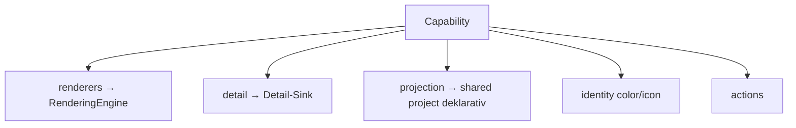

## Überblick

Eine **Capability** ist die Erweiterungseinheit eines Features in der neuen,
descriptor-basierten App. Sie bündelt alle Schichten, die ein „Kind" (ein
Content-Typ oder eine Knowledge Entity) braucht — Stream-Card, Detail-Ansicht,
Identität (Farbe/Icon), Intent-Vokabular, Actions — und registriert sie mit
**einem** Aufruf, statt sie über fünf Dateien zu verstreuen.

Capabilities und das [Plugin-System](/features/plugins) greifen ineinander: Das
Plugin-System liefert Manifest, Trust-Level, Sandbox und Marketplace; die
Capability ist der **descriptor-native, vertrauenswürdige Weg**, einen `typeView`
oder `renderer` tatsächlich zu bauen. First-party-Features sind Capabilities auf
Trust-Level *official*; ein Community-Plugin liefert dieselbe Capability-Form,
nur sandboxed.



<Callout kind="info">

**Status: Entwurf (Pre-Launch).** Dieses Dokument beschreibt das Zielmodell und
den heutigen Stand. Implementiert sind die Sinks **renderers** und **detail**;
Identität, Intent und Actions für neue Kinds sind als Pfad beschrieben und in
Arbeit. Die `Capability`-Vertragsgrenze lebt heute in der App und wandert in ein
Paket, sobald sie stabil ist.

</Callout>

## Kinds: Content-Typen und Knowledge Entities

Eine Capability besitzt **Kinds**, nicht nur Content-Typen. Ein Kind ist entweder
ein **Content-Typ** (`task`, `bookmark`, `event` — was du erfasst) oder eine
**Knowledge Entity** (`person`, `organization`, `place` — die Graph-Knoten, auf
die Inhalte verweisen). Beide leben in **einer** [Content-Type-Registry](/features/content-types),
getrennt nur durch `category` (`content` | `knowledge_entity` | `entity`).

Für beide gelten dieselben Sinks. Knowledge Entities haben zwei Zusatz-Belange —
**Beziehungen** (an welchen `relationship-kinds` der Typ teilnimmt) und
**Kontext-Felder** (strukturierte Felder wie Rolle/Firma bei einer Person).

## Die Sinks einer Capability

| Slice | Was | Verdrahtung | Status |
| --- | --- | --- | --- |
| `renderers` | Stream-Card-Renderer (`type → Renderer`) | App injiziert in die `RenderingEngine` | **implementiert** |
| `detail` | Detail-Sheet-Komposition pro `content_type` | App injiziert in den Detail-Sink | **implementiert** |
| `projection` | `content_type → Komponente` | **deklarativ** — Quelle bleibt die reine `project()` | deklariert |
| `components` | Katalog-Defs (Server-/`render_ui`-Validierung) | Server/Assistant | deklariert |
| Identität | Farb-/Icon-Token des Kinds | Core-Default (shared) **oder** Plugin-Override | geplant |
| `intent` | Subtype-Vokabular | Core-Default (shared) **oder** Neukind-Injektion | geplant |
| `actions` | Action-Manifest (z. B. „In Kalender") | Action-Dispatch | geplant |

## Drei Schichten der Verdrahtung

Das ist das wichtigste mentale Modell — **nicht jede Slice wird von der Capability
zur Laufzeit verdrahtet:**

<Steps>
  <Step title="App-injiziert" icon="plug">

  `renderers` und `detail` werden von der App in ihre Sinks geschoben
  (`RenderingEngine`, Detail-Sink). Hier ist die Capability die **alleinige
  Quelle** des Kinds.

  </Step>
  <Step title="Core-Default / shared" icon="lock">

  Für **Core-Kinds** liegen `projection`, Identität und `intent` im geteilten,
  isomorphen Layer (`shared/project()`, `content-type-registry`,
  `intent-engine`). Die Capability **referenziert** sie — sie verdrahtet sie
  nicht zur Laufzeit (Determinismus, siehe unten).

  </Step>
  <Step title="Neukind-injiziert" icon="puzzle">

  Ein **neues Kind** (typischerweise von einem Plugin) bringt Identität, Intent
  und Beziehungen selbst mit und **injiziert** sie über die Erweiterungspunkte —
  weil es im Shared-Layer noch nicht existiert.

  </Step>
</Steps>

## Das Determinismus-Gesetz

<Callout kind="warning">

Eine Capability **produziert niemals die Projektion.** Der Stream entsteht aus
einer reinen, isomorphen `project(events)`-Reduktion mit byte-gleichem Replay.
Capabilities erweitern ausschließlich die **Render-Schicht** (Descriptors/
Renderer), die **Action-Schicht** und — für Erzeugtes — die **Ephemeral-Lane**.
Die `content_type → Komponente`-Zuordnung wird nur **deklarativ** beigetragen,
nie als Laufzeit-Mutation.

</Callout>

## Governance & Trust

Wer darf welche Kind-Identität (Farbe/Icon/Label) definieren? Das folgt den
[Trust-Levels](/features/plugins) des Plugin-Systems:

- **Core-Kinds** (`person`, `task`, `event` …) gehören dem Core/Shared-Layer; ihre
  Identität ist der autoritative Default.
- **Plugins fügen NEUE Kinds hinzu und besitzen deren Identität vollständig** —
  eigene Farbe, eigenes Icon, eigene Renderer und Beziehungen.
- **Eine Core-Kind-Identität zu überschreiben** ist auf trusted/official-Tier
  beschränkt; ein Community-Plugin kann nicht „Person" umfärben und die Kohärenz
  brechen.

Auflösung also: **Plugin-Override (eigenes Kind / trusted) → Core-Default (shared)
→ Neutral.**

## Content-Typen ↔ Capabilities: zwei Achsen

Farbe, Icon und Label sind **Eigenschaften des Content-Typs** — sie leben in der
[Registry](/features/content-types), genau wie heute schon `icon` und `label`.
Capabilities und Registry sind **zwei Achsen, keine Hierarchie:**

- **Registry = horizontal, server-autoritativ:** *was ein Typ ist* (Erkennung,
  Schlüssel, Embedding, Vision, Identität). Die schwere Logik (`BEHAVIORS`) ist
  server-only und erreicht eine Capability nie.
- **Capability = vertikal, client-/feature-seitig:** *wie ein Feature rendert und
  sich verhält.*

Sie treffen sich am **`content_type`-Schlüssel**. Eine Capability **referenziert**
Typen, sie **forkt sie nie**. Das Design-System (der Komponenten-Pack) *leitet*
das gerenderte Aussehen aus dem Identitäts-Token ab (Light/Dark, Glow, Chips per
`color-mix`).

## Worked Example: `event`

Das Feature „Termin" ist heute über fünf Dateien verstreut. Als Capability wird es
zu einer Einheit. Stand: Renderer- und Detail-Slice sind verdrahtet.

<Steps>
  <Step title="Vertrag" icon="file-code">

  Der `Capability`-Vertrag plus `registerCapability` (App-seitig, wandert später
  in ein Paket):

  ```ts
  export interface Capability {
    id: string;
    components?: readonly ComponentDef[];                 // Server/render_ui
    renderers?: Record<string, Renderer>;                 // → RenderingEngine
    detail?: { contentTypes: readonly string[]; compose: DetailComposer };
    projection?: { componentByContentType?: Record<string, string> }; // deklarativ
  }

  export function registerCapability(cap: Capability, engine?: RenderingEngine): void;
  ```

  </Step>
  <Step title="Die Capability" icon="box">

  ```ts
  import { brainzCardsRenderers } from "@assistant-kit/pack-brainz-cards/renderers";
  import { composeEvent } from "../detail-compositions.js";
  import type { Capability } from "../capability.js";

  export const eventCapability: Capability = {
    id: "event",
    renderers: { EventCard: brainzCardsRenderers.EventCard },
    detail: {
      contentTypes: ["event", "appointment", "google_calendar"],
      compose: composeEvent,            // Zeit · Ort · Teilnehmer · Conference-Link
    },
    // DEKLARATIV — Quelle bleibt die reine project() (Determinismus):
    projection: {
      componentByContentType: { event: "EventCard", appointment: "EventCard", meeting: "EventCard" },
    },
  };
  ```

  </Step>
  <Step title="Registrierung" icon="plug">

  Die App registriert die Capability beim Start. `EventCard` läuft dann über die
  Capability statt über das globale Pack-Bundle:

  ```ts
  const engine = new RenderingEngine();
  const coreCardRenderers = Object.fromEntries(
    Object.entries(brainzCardsRenderers).filter(([type]) => type !== "EventCard"),
  );
  engine.registerPack(coreCardRenderers);
  registerCapability(eventCapability, engine);
  ```

  </Step>
</Steps>

<Callout kind="info">

Die Detail-Komposition läuft über einen **Detail-Sink**: `composeDetail`
konsultiert die von Capabilities registrierten Composer, bevor der eingebaute
Familien-Switch greift. So besitzt die Capability die Detail-Slice als einzige
Quelle.

</Callout>

## Knowledge Entities als Kinds

Knowledge Entities (Personen, Orte, Organisationen, Events als Graph-Knoten)
gehören genauso ins Modell. Es gibt dafür bereits ein Registry-Muster
(`renderStreamCard`/`renderDetailPanel`/`renderContextRow`/`getContextFields` pro
`entity_type:subtype`) — Capabilities modernisieren es. Die Graph-Schicht
(`openEntity`-Drill, `brainz://kind/id`-Refs, verwandte/verknüpfte Inhalte,
`relationship-kinds`) existiert bereits; eine KE-Capability steckt ihre Identität
und Render dort hinein.

Server-autoritativ und nur **referenziert** (nicht im Client gebaut): die
**Extraktion/Resolution** der Entity (NER, `resolve_entity`, `attach_entities`).

## Schema-getriebenes Detail

Eine `detail`-Slice muss nicht handgeschrieben sein. Da Brainz Entitäts-Fakten als
schema.org-getyptes `structured_data` speichert — und `shared/schema-definitions.js`
pro Typ `properties` und `views` deklariert — kann eine Detailansicht **deklarativ**
aus einer View-Spec plus den Daten entstehen, über `renderSchemaView`:

```ts
import { renderSchemaView, type SchemaView } from "../detail-compositions.js";

const PERSON_VIEW: SchemaView = {
  fields: [
    { keys: ["role", "jobTitle", "job_title"], label: "Position", icon: "user" },
    { keys: ["company", "worksFor", "organization"], label: "Unternehmen", icon: "tag" },
    { keys: ["email"], label: "E-Mail", icon: "mail" },
    { keys: ["birthday", "birthDate"], label: "Geburtstag", icon: "cal", format: "date" },
  ],
  bodyKeys: ["notes", "description"],
};
```

`keys` listet die `structured_data`-Felder samt **Aliasen** (erster nicht-leerer
Wert gewinnt) — gespiegelt aus den schema.org-`properties`. Der Renderer ist rein
und damit deterministisch.

<Callout kind="info">

**Zwei Schichten fürs Detail:** der **schema-getriebene Default** (deklarativ und
sicher — ideal für neue oder Community-Kinds ohne Code) und der **kuratierte
Composer** als Override für hohe Politur (Reihenfolge, Buttons, Spezialformate).
Sie schichten.

</Callout>

## Worked Example: `person` (Knowledge Entity)

`person` ist ein Graph-Knoten, kein Stream-Typ — daher **keine `renderers`**. Es
trägt Identität (Farbe) und ein schema-getriebenes Detail:

```ts
export const personCapability: Capability = {
  id: "person",
  colors: { person: { light: "#D06690", dark: "#E58BB0" } },
  detail: {
    contentTypes: ["person"],
    compose: (_props, detail) => renderSchemaView(PERSON_VIEW, detail),
  },
};
```

`colors` registriert das Identitäts-Token über den Color-Sink (Kaskade
Override → Default → Neutral). Beziehungen kommen über die bestehende
Detail-Modul-Schicht (verwandte/verknüpfte Inhalte), wenn die Entity verknüpft ist.

## Capability-Referenz

<ParamField body="id" param-type="string" required="true">
Stabile Kennung der Capability, z. B. `event`.
</ParamField>

<ParamField body="renderers" param-type="Record (string → Renderer)">
Stream-Card-Renderer pro Komponententyp. Werden in die `RenderingEngine`
registriert. **Implementiert.**
</ParamField>

<ParamField body="detail" param-type="{ contentTypes: string[]; compose: DetailComposer }">
Detail-Sheet-Komposition für die genannten `content_type`s. Reine Funktion
(gleiche Eingaben ⇒ gleiche Nodes). `compose` kann ein kuratierter Composer
oder `renderSchemaView(view, detail)` sein. **Implementiert.**
</ParamField>

<ParamField body="colors" param-type="Record (string → { light; dark })">
Identitäts-Farb-Token pro Kind. Überschreibt den Pack-Default (Kaskade
Override → Default → Neutral). **Implementiert.**
</ParamField>

<ParamField body="projection" param-type="{ componentByContentType?: Record (string → string) }">
**Deklarative** Spiegelung der `content_type → Komponente`-Zuordnung. Die
autoritative Quelle bleibt die reine `project()` (Determinismus-Gesetz).
</ParamField>

<ParamField body="components" param-type="ComponentDef[]">
Katalog-Definitionen für die Server-/`render_ui`-Validierung. Der Client rendert
über `renderers`.
</ParamField>

## Ein neues Kind beitragen (Plugin-Pfad)

<Callout kind="info">

Dieser Abschnitt beschreibt den **geplanten** Pfad für neue Kinds. Die
Erweiterungspunkte für Identität, Intent und Beziehungen sind in Arbeit.

</Callout>

Ein externes Plugin, das einen **neuen** Kind einführt, liefert beide Achsen:

<Steps>
  <Step title="Registry-Eintrag (Server/Semantik)" icon="database">

  Neuen `content_type` bzw. `entity_type` in der Registry deklarieren — Erkennung,
  Schlüssel, Kategorie, Promotion. Damit erkennt, embeddet und durchsucht der
  Server den Typ. Das Plugin-Manifest trägt dafür `contentTypes[]`.

  </Step>
  <Step title="Capability (Client/Design)" icon="palette">

  Identitäts-Token (Farbe/Icon), `renderers`, `detail`, `intent`-Vokabular und —
  bei Knowledge Entities — Beziehungen mitbringen. Für ein neues Kind ist die
  Capability die alleinige Quelle dieser Slices.

  </Step>
</Steps>

Single-Source-Generierung (einen Typ einmal beschreiben und daraus Registry-Slice
**und** Capability-Stub erzeugen) ist die spätere Kür, kein Muss.
