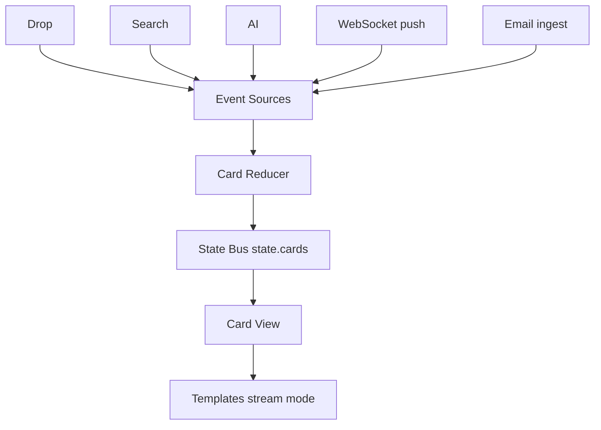

## Überblick

Der Content Stream ist die primäre, nutzerseitige Timeline in brainz: ein chronologischer, append-only Ereignisstrom und keine klassische Listenansicht. Neue Einträge erscheinen unten und bilden eine fortlaufende, chatartige Abfolge von Karten.

Durch diesen Stream laufen alle relevanten Interaktionen: Suchtreffer, Captures aus Drops, AI-Antworten, geteilte Inhalte, Insights und Brainflow-Schritte. Jede sichtbare Karte steht dabei für ein Ereignis im zeitlichen Verlauf, nicht nur für ein Objekt an sich.

<Callout kind="info">

Der Content Stream ist event-sourced. Dieselbe Kartenfolge lässt sich deterministisch aus den zugrunde liegenden Events erneut aufbauen. Eine Suchtreffer-Karte repräsentiert daher das Suchereignis, nicht nur das gefundene Objekt. Eine AI-Karte bildet den Prozesszustand ab, etwa von Thinking über Streaming bis zum finalen Ergebnis.

</Callout>

Dieses Modell ist wichtig, weil dieselbe Entität mehrfach im Stream erscheinen kann, wenn unterschiedliche Ereignisse sie betreffen. Ein Objekt wird im Stream nicht als statischer Datensatz gezeigt, sondern als zeitlicher Kontext rund um dieses Objekt.

## Architektur

Die Stream-Architektur trennt Ereignisquellen, Zustandsreduktion, autoritativen Zustand und Rendering klar voneinander. Dadurch bleiben Karten reproduzierbar, reaktiv patchbar und in Echtzeit synchronisierbar.



| Layer | Rolle | Typische Quellen oder Eingaben |
| --- | --- | --- |
| Event Sources | Liefern rohe Ereignisse aus Client und Server | Drop, Search, AI, WebSocket-Push, Email-Ingest |
| Card Reducer | Entscheidet über `card.added`, `card.patched` und `card.dismissed` | Eingehende Stream-Events |
| State Bus | Hält `state.cards[]` als autoritative Kartenliste | Reduzierter Stream-Zustand |
| Card View | Leitet DOM-Änderungen aus dem Zustand ab und mountet oder entfernt `article`-Elemente | `state.cards[]` |
| Templates | Erzeugen Karten im `stream()`-Modus mit DOM-Element und Lifecycle-Hooks | `shared/templates/*.tpl.js` |

Event Sources liefern nur rohe Ereignisse. Erst der Card Reducer entscheidet, ob daraus eine neue Karte entsteht, eine bestehende Karte gepatcht wird oder sich nur ihr Dismiss-Zustand ändert.

`state.cards[]` ist die Single Source of Truth für die sichtbare Reihenfolge und den aktuellen Zustand aller Karten. Die Card View besitzt keinen eigenen fachlichen Zustand, sondern wird vollständig aus `state.cards[]` abgeleitet und reconciled nur das DOM.

<Callout kind="info">

**In v2** ist dieses Modell descriptor-nativ umgesetzt: Die Reduktion ist die **reine `project(events)`-Funktion** (byte-gleiches Replay, `cardId` aus der Event-ID), eine Karte ist ein **Descriptor** `{ component, props }`, und das Rendering liefern die **[Capability](/features/capabilities)- und Pack-Renderer** über die `RenderingEngine` — mit gezieltem In-Place-Patch statt Remount. Die hier beschriebenen Card-Reducer- und Template-Mechanismen sind die Vorgänger-Implementierung desselben Modells.

</Callout>

## Card-Typen im Stream

Im Stream erscheinen unterschiedliche Kartentypen, je nach auslösendem Ereignis und Verarbeitungsphase. Die folgende Übersicht beschreibt die wichtigsten Typen.

| Karten-Typ | Herkunft | Typisches Verhalten im Stream |
| --- | --- | --- |
| Search result card | Suche und Suggestions | Erscheint als Trefferkarte aus einem Suchereignis |
| Drop/Capture card | Nutzerinitiierter Drop oder Command | Sofort sichtbar, niemals automatisch gedriftet |
| AI response card | AI-Verarbeitung | Durchläuft Thinking-, Streaming- und Final-Zustände |
| Inbox/shared item card | Shares, Inbox, externe Zuflüsse | Repräsentiert eingehende oder geteilte Inhalte |
| Insight card | Insight- oder Analyse-Pipeline | Zeigt verdichtete Hinweise und Muster |
| Brainflow step card | Flow-Ausführung | Macht einzelne Schritte einer Ausführung sichtbar |
| Quick hint card | Prädiktive oder kontextsensitive Hilfe | Kurzlebig, meist als temporärer Hinweis |

Zwei Karten können sich auf dieselbe Entität beziehen und trotzdem getrennt im Stream erscheinen. Das ist kein Duplikatfehler, sondern Ausdruck verschiedener Ereignisse mit eigener zeitlicher Bedeutung.

## Stream-Modus der Templates

Im Stream-Modus geben Templates kein HTML als String zurück, sondern ein Objekt mit DOM-Element und Lifecycle-Hooks. Dadurch bleibt eine Karte über ihre Lebensdauer hinweg dieselbe Instanz und kann direkt im DOM weiterentwickelt werden.

```javascript show-lines={true}
registry.register("ai.response", {
  stream(card, R) {
    const el = R.streamHelpers.card({
      id: card.id,
      kind: "ai",
      status: card.status,
      header: R.streamHelpers.header({
        title: card.title,
        subtitle: card.subtitle,
        status: card.status
      }),
      body: `
        <div data-patch-field="body">${card.bodyHtml || ""}</div>
      `,
      tags: card.tags || [],
      footer: R.streamHelpers.actionBar({
        actions: ["copy", "dismiss"]
      })
    });

    return {
      el,
      hooks: {
        onMount(node) {
          node.dataset.mounted = "true";
        },
        onUpdate(node, nextCard) {
          node.dataset.status = nextCard.status;
        },
        onDismiss(node) {
          node.classList.add("is-dismissing");
        }
      }
    };
  }
});
```

Der `stream()`-Vertrag liefert `el` und `hooks` statt eines HTML-Strings. Eine Stream-Karte enthält die vollständige `article`-Hülle mit Header, Body, Tags, Footer und Aktionen und nutzt `data-patch-field`-Marker für reaktive Feld-Updates.

Gemeinsame Infrastruktur kommt aus `R.streamHelpers`, etwa Header-Builder, Status-Chips und Action Bars. Die Lifecycle-Hooks `onMount`, `onUpdate` und `onDismiss` ergänzen die reine Darstellung um kontrollierte Reaktionen auf Zustandsänderungen.

Im Unterschied zu klassischen List-Renderern wird die Karte nicht bei jeder Änderung neu als String erzeugt. Sie wird einmal gemountet, im DOM gezielt gepatcht und am Ende ihres sichtbaren Lebenszyklus dismissed.

## Reaktives Patching

Das Patching folgt einem abgestuften Drei-Tier-Modell. Die Pipeline wählt die billigste passende Aktualisierung, bevor sie auf teurere Fallbacks zurückgreift.

| Tier | Mechanismus | Typische Felder oder Änderungen | Typische Kosten |
| --- | --- | --- | --- |
| Tier 1 | Field patcher über `data-patch-field` | Titel, Status, Body-Text, Counter | ungefähr 0 ms |
| Tier 2 | `hooks.onUpdate` | Strukturelle Subtrees, Zustandswechsel, UI-Umschaltungen | ungefähr 1 ms |
| Tier 3 | Full re-render | Tiefe Layout- oder Template-Änderungen, seltener Fallback | ungefähr 2 bis 5 ms |

Tier 1 aktualisiert einzelne Felder direkt über markierte Patch-Ziele. Dieser Pfad ist der schnellste und deckt die häufigsten Änderungen ab, etwa Statuswechsel oder Text-Updates.

Tier 2 nutzt `hooks.onUpdate`, wenn sich Teilbereiche strukturell ändern oder ein Zustandswechsel mehr als reine Textersetzung verlangt. Dazu gehören Umschaltungen zwischen Streaming- und Final-Ansicht oder das Ersetzen kleiner Subtrees.

Tier 3 rendert die Karte vollständig neu, wenn das bestehende DOM nicht sicher oder wirtschaftlich weiterverwendet werden kann. Dieser Pfad ist bewusst selten und dient als Fallback für tiefergehende Template-Wechsel.

## Echtzeit-Synchronisation

Der Content Stream verbindet Live-Updates mit lokaler Ereignisverarbeitung. Echtzeit und Offline-Verhalten greifen dabei ineinander, statt sich gegenseitig auszuschließen.

| Mechanismus | Zweck | Wirkung im Stream |
| --- | --- | --- |
| `GET /api/events/observe` | Lang laufender NDJSON-Observe-Stream | Liefert kontinuierliche Server-Events für Live-Updates |
| WebSocket-Kanal | Schneller Wake-up-Mechanismus | Benachrichtigt sofort über neue Aktivität |
| Change Bus | Verteilt Entitätsänderungen an alle betroffenen Karten | Hält mehrere Karten mit derselben Referenz konsistent |
| Event Store bis Fan-out | Geräteübergreifende Synchronisation | Repliziert Ereignisse über mehrere Geräte hinweg |

<Callout kind="info">

Offline und Echtzeit schließen sich nicht aus. Lokale Events lassen sich aus IndexedDB erneut abspielen und später mit dem Serverzustand zusammenführen. Die Synchronisationskette verläuft dabei von Event Store über IndexedDB und Event Uploader zum Server, der die Änderungen anschließend an andere Geräte verteilt.

</Callout>

Der NDJSON-Observe-Stream unter `GET /api/events/observe` hält eine langlebige Verbindung für Server-Pushs offen. Parallel dazu sorgt ein WebSocket-Kanal für schnelle Wecksignale, damit neue Ereignisse ohne manuelles Refresh sichtbar werden.

Der Change Bus propagiert Entitätsänderungen an alle Karten, die dieselbe Entität anzeigen. So bleiben verschiedene Karteninstanzen konsistent, auch wenn sie aus unterschiedlichen Ereignissen entstanden sind.

## Auto-Dismiss (Drift)

Auto-Dismiss steuert den sichtbaren Lebenszyklus kurzlebiger Karten, ohne die zugrunde liegende Ereignishistorie zu löschen. Der Ablauf besteht aus Erkennung, sichtbarem Drift und synchronisierter Persistierung.

<Callout kind="tip">

Drop-Cards, also nutzerinitiierte Captures, driften niemals automatisch. Diese Karten bleiben sichtbar, bis ein expliziter Dismiss erfolgt.

</Callout>

<Steps>
  <Step title="Inaktivität erkennen" icon="clock">

  Eine Karte überschreitet ihr Interaktions-Timeout und wird damit zum Drift-Kandidaten. Dieser Schritt betrifft nur die Sichtbarkeit im Stream, nicht die Existenz des zugrunde liegenden Events.

  </Step>
  <Step title="Drift-Animation ausführen" icon="play-circle">

  Die Karte durchläuft eine sichtbare Drift- oder Release-Phase. Die Zustandsänderung wird dadurch für dich nachvollziehbar, statt abrupt aus dem Stream zu verschwinden.

  </Step>
  <Step title="Dismiss synchron persistieren" icon="check-circle">

  Das System erzeugt ein `card.dismissed`-Ereignis mit `scope: "synced"` und persistiert es geräteübergreifend. Andere Geräte übernehmen denselben Sichtbarkeitszustand.

  </Step>
</Steps>

Auto-Dismiss ändert nur die Sichtbarkeit einer Karte im Stream. Das zugrunde liegende Ereignis bleibt weiterhin replaybar und auditierbar.

## Unterschied zu Listen-Ansichten

Der Content Stream und klassische Listenoberflächen zeigen oft dieselben Entitäten, aber mit unterschiedlicher Bedeutung. Der Unterschied liegt im Modell, in der Datenquelle und im Rendering.

| Aspekt | Content Stream | Type View / List View |
| --- | --- | --- |
| Mental Model | Timeline oder Feed | Liste oder Inventar |
| Datenquelle | Event-sourced Stream | API-Query |
| Rendering | Descriptor-Karten über Capability-Renderer (v2; `stream()`-Lifecycle als Vorgänger) | `row()` oder `preview()` als HTML-Strings |
| Reihenfolge | Chronologisch, append-only | Sortierbar und filterbar |
| Echtzeit | Vollständig live per Push | Polling oder manuelles Refresh |
| Offline | Replay aus IndexedDB | Benötigt Netzwerk |

Dieselbe Entität kann auf beiden Oberflächen erscheinen und dort etwas anderes bedeuten. Eine Aufgabe in einer Liste ist ein Inventareintrag, dieselbe Aufgabe im Stream ist ein zeitliches Ereignis, etwa erstellt, geändert, vorgeschlagen oder abgeschlossen.

## API-Endpunkte

Die folgenden Endpunkte speisen den Stream mit Event-Daten. Sie liefern keine fertigen HTML-Fragmente, sondern Rohdaten, aus denen Reducer, State Bus und Templates die sichtbaren Karten deterministisch erzeugen.

| Endpunkt | Beitrag zum Stream | Typische Karten |
| --- | --- | --- |
| `POST /api/search` | Erzeugt Suchereignisse und Treffer | Search result cards |
| `POST /api/commands` | Nimmt Drops und Commands an | Drop/Capture cards |
| `GET /api/events/observe` | Liefert kontinuierliche NDJSON-Events | Live-Updates aller Stream-Karten |
| `GET /api/predictive/next` | Liefert prädiktive Vorschläge | Quick hint cards |
| `GET /api/insights` | Liefert verdichtete Hinweise und Muster | Insight cards |

<Callout kind="info">

Diese Endpunkte liefern Event-Daten, nicht fertig gerenderte Karten. Sichtbare Karten entstehen deterministisch erst durch Card Reducer, `state.cards[]`, Card View und die Templates im `stream()`-Modus.

</Callout>