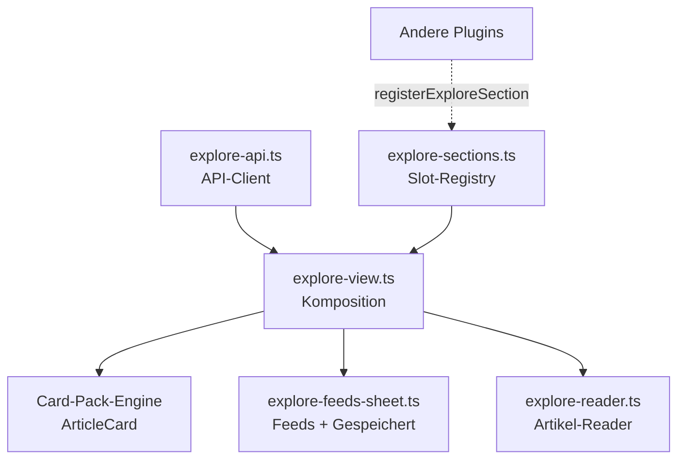

## Überblick

**Entdecken** ist die Lese-Oberfläche der Mobile-App neben dem [Content Stream](/features/content-stream): ein kuratierter Strom aus News- und RSS-Inhalten (`shared_content`), mit KI-Tagesbriefing, Trending-Reihe, Quellen-Filtern, Feeds-Verwaltung, gespeicherten Artikeln und einem werbefreien Reader.

Das Modul stammt funktional aus der alten App und wurde auf das **v2-Plugin- und Interface-System** portiert: Karten rendern über die [Card-Pack-Engine](/features/plugins), die Datenanbindung läuft über einen typisierten API-Client, und die Oberfläche ist über eine **Slot-Registry** erweiterbar — analog zu den Detail-Card-Sektionen.

<Callout kind="info">

Entdecken liest dieselben `shared_content`-Daten, die die [Enrichment-Pipeline](/features/integrations) und die Cloudflare-Worker (RSS-Fetcher, Email-Ingest) füllen. Die Oberfläche ist überwiegend read-only; schreibend sind nur Lifecycle-Aktionen (speichern, anheften, Feed abonnieren, Artikel extrahieren).

</Callout>

## Architektur

Die Oberfläche trennt **Datenanbindung** (API-Client), **Komposition** (Slot-Registry) und **Rendering** (Card-Pack-Engine). Dadurch können andere Plugins die Entdecken-Surface an definierten Stellen erweitern, ohne den Kern anzufassen.

| Datei | Rolle |
| --- | --- |
| `explore-api.ts` | Typisierter Client um `/api/shared-content/*` + `/api/explore/briefing`; Auth via Bearer-Token aus `localStorage` |
| `explore-sections.ts` | Slot-Registry: `registerExploreSection`, `exploreSectionsFor`, Slots `lead · strip · filter · inline` |
| `explore-view.ts` | Komposition der Surface: Briefing, Facetten, Trending, Artikel-Feed + Plugin-Sektionen pro Slot |
| `explore-feeds-sheet.ts` | Host-Sheet: Feeds abonnieren/verwalten (mit Auto-Discovery) und Tab „Gespeichert" |
| `explore-reader.ts` | Host-Sheet: Hero + Quelle/Titel/Meta + Text, „Vollständig laden" (Readability), „Festhalten" |

### Slot-Registry

Plugins erweitern Entdecken über `registerExploreSection({ id, slot, rank, render })` — gleiches Muster wie die [Detail-Card-Sektionen](/features/plugins). Jede Sektion liefert ein DOM-Element für einen definierten Slot; `rank` bestimmt die Reihenfolge.

| Slot | Position | Gedacht für |
| --- | --- | --- |
| `lead` | Ganz oben | KI-Tagesbriefing, prominente Hinweise |
| `strip` | Horizontale Reihe | Trending, Transit-Abfahrten, Wetter |
| `filter` | Filter-/Facetten-Leiste | Quellen-Filter, Plugin-Facetten |
| `inline` | Im Artikel-Feed | Kalender-Events, eingestreute Karten |

<Callout kind="tip">

So lassen sich **Transit**, **Kalender/Feiertage** und **iCal-Abos** künftig als eigenständige Plugins anbinden, die ihre Karten in `strip` bzw. `inline` einklinken — statt sie fest in den Entdecken-Kern zu verdrahten. Die Backend-Routen (`/api/transit/*`, `/api/timeline/*`) sind bereits vorhanden.

</Callout>

## API-Client

`explore-api.ts` deckt das v1-Subset der 23 Explore-Endpunkte ab (Discover · Feeds · Saved · Reader). Alle Wrapper sind null-sicher und fangen Fehler kontrolliert ab.

| Funktion | Endpunkt | Zweck |
| --- | --- | --- |
| `browse(params)` | `GET /api/shared-content` | Discover-Feed (Sort, Filter, Paging) |
| `trending(limit)` | `GET /api/shared-content/trending` | Trending-Reihe (`strip`) |
| `saved(params)` | `GET /api/shared-content/saved` | Gespeicherte Artikel |
| `detail(id)` | `GET /api/shared-content/:id` | Einzelartikel |
| `briefing()` | `GET /api/explore/briefing` | KI-Tagesbriefing (`lead`) |
| `relate(id, status)` | `POST /api/shared-content/:id/relate` | Speichern/Archivieren |
| `setPinned(id, pinned)` | `PUT /api/shared-content/:id/relation` | Anheften |
| `extractArticle(id)` | `POST /api/shared-content/:id/extract-article` | Readability-Volltext |
| `listFeeds()` | `GET /api/shared-content/feeds` | Abonnierte Feeds |
| `discover(url)` | `POST /api/shared-content/feeds/discover` | Feed-URLs aus einer Seite finden |
| `subscribe(url, title)` | `POST /api/shared-content/feeds` | Feed abonnieren |
| `refreshFeed(id)` / `unsubscribe(id)` | `POST` / `DELETE .../feeds/:id` | Aktualisieren / abbestellen |

Hilfsfunktionen: `domainOf(url)` (Anzeige-Domain), `decodeEntities(s)` (HTML-Entities in Titeln, z.B. `&amp;`), `faviconUrl(domainOrUrl, size)` → URL zum [Favicon-Service](/features/integrations#favicon-service).

## Teil-Oberflächen

<Columns cols={3}>
  <Card title="Discover-Feed" icon="compass">
    Briefing, Trending, Quellen-Facetten und der Artikel-Feed. Tap öffnet den Reader, Pin speichert.
  </Card>
  <Card title="Feeds & Gespeichert" icon="rss">
    Host-Sheet mit zwei Tabs. Neue Feeds per URL — Auto-Discovery findet den RSS/Atom-Link selbst.
  </Card>
  <Card title="Artikel-Reader" icon="book-open">
    Tall-Sheet mit Hero, Quelle und Text. „Vollständig laden" holt den werbefreien Readability-Volltext.
  </Card>
</Columns>

Beide Sheets folgen dem **Host-Sheet-Muster**: einmaliges `injectStyles`, Backdrop, `pushBackLayer` für den Zurück-Stack und das `afterClose`-Muster (Folgeaktion erst nach dem Schließen). Konsequent brainz-ink: Zwei-Akzent (Quellfarbe NON-AI, Violett nur für echte KI-Zusammenfassungen), Icons ausschließlich via `bzIcon`, kein FAB.

## Karten-Rendering

Artikel rendern über die Card-Pack-Engine als `ArticleCard` (`engine.render(node, dispatch)`). Da `Action.action` eine feste Union ist, transportieren Tap/Pin die Absicht als `sendMessage`-Text (`open-article <id>` / `save-article <id>`), den der `dispatch` der View parst. Pro Quelle wird die Akzentfarbe (`--tc-l`/`--tc-d`) gesetzt; full-bleed-Hero, wenn ein Bild vorliegt, sonst Excerpt.

Im Kicker zeigt die Karte das **Favicon der Quelle** statt des Typ-Icons. Das Typ-Icon bleibt als Platzhalter sichtbar, bis das Favicon geladen ist, und dient bei Ladefehler als Fallback — der Kicker ist nie leer.

## Compose-Katalog-Erweiterungen

Neue UI-Bausteine wurden in den geteilten [Compose-Katalog](/features/plugins) (`compose-sheet.ts`) eingebracht, damit andere Plugins davon profitieren:

- **`tokens`** — Chip-/Stichwort-Liste (`string[]`), z.B. für Tag-Eingabe.
- **`urlDiscover`** — URL-Feld mit Feed-Auto-Discovery: tippt der Nutzer eine Seiten-URL, schlägt das Feld gefundene Feeds zur Auswahl vor (nutzt `discover`).

Beide sind im Katalog-Mockup (`docs/brainz-mobile/mockups/compose-catalog.html`) demonstriert.

## Nächste Schritte

<Columns cols={2}>
  <Card title="Plugin-System" href="/features/plugins" icon="puzzle" cta="Slots & Card-Packs">
    Slot-Registry und Card-Pack-Engine im Detail.
  </Card>
  <Card title="Integrationen & Enrichment" href="/features/integrations" icon="cable" cta="Favicon-Service & RSS">
    Datenquellen, RSS-Worker und der Favicon-Service.
  </Card>
  <Card title="Content Stream" href="/features/content-stream" icon="activity" cta="Die Schwester-Surface">
    Die event-sourced Timeline neben Entdecken.
  </Card>
  <Card title="Design-Tokens" href="/features/design-tokens" icon="palette" cta="brainz-ink-Kanon">
    Zwei-Akzent, 3-Schicht-Tokens, Motion.
  </Card>
</Columns>
