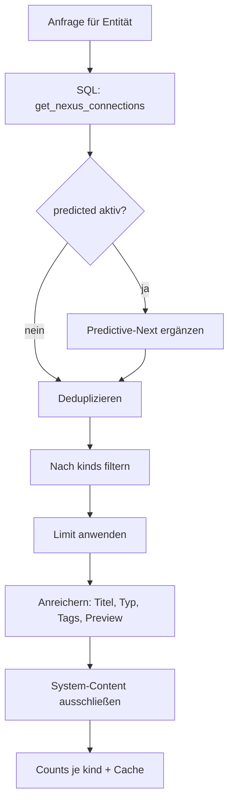

## Überblick

Nexus ist die Connection-Intelligence-Schicht von Brainz. Während die [Hybrid Search](/features/content#hybrid-search-layer-2) aktiv auf eine Suchanfrage antwortet und der [Predictive-Next-Engine](/features/ai) proaktiv den wahrscheinlich nächsten Inhalt vorschlägt, beantwortet Nexus eine andere Frage:

> **„Womit hängt *dieses eine* Objekt zusammen — und warum?"**

Dafür fasst Nexus mehrere unabhängige Verbindungssignale — explizite Verknüpfungen, Collection-Mitgliedschaft, gemeinsame Knowledge Entities, entdeckte Verbindungen, semantische Ähnlichkeit und Echtzeit-Prognosen — in einer einzigen, nach Relevanz sortierten Liste zusammen. Das Ergebnis ist das Kontext-Panel hinter jeder Detailansicht: „verwandte Inhalte", „gehört zu", „ähnlich wie", „könnte als Nächstes relevant sein".

<Callout kind="info">

Der Kern läuft in der Datenbank. Die SQL-Funktion `app_public.get_nexus_connections(entity_type, id, min_score, limit)` aggregiert fünf Verbindungsarten in einem einzigen Aufruf. Eine sechste Art — `predicted` — wird zur Laufzeit ergänzt, weil sie dynamisch und nutzerkontextabhängig ist.

</Callout>

## Verbindungsarten

Nexus kennt sechs Verbindungsarten (`kind`). Fünf stammen aus der SQL-Composite-Funktion, eine wird im Application-Layer ergänzt.

| Art (`kind`) | Quelle | Bedeutung | Typischer Score |
| --- | --- | --- | --- |
| `attachment` | `app_public.attachments` | Explizite, vom Nutzer angelegte Verknüpfung (bidirektional ausgewertet) | `1.0` |
| `collection` | `collection_members` + `collections` | Gemeinsame Mitgliedschaft in derselben Collection | regelbasiert |
| `entity` | `ke_context_links` + `knowledge_entities` | Zwei Inhalte verweisen auf dieselbe Knowledge Entity (Ko-Okkurrenz) | nach Entity-Overlap |
| `suggested` | `discovered_connections` | Vom Insight-Engine entdeckte Verbindung | Engine-Score |
| `similar` | `asset_embeddings` (pgvector Cosine) | Semantische Ähnlichkeit über Embeddings | `1 − Cosine-Distanz` |
| `predicted` | Predictive-Next-Engine (Laufzeit) | Wahrscheinlich relevanter nächster Inhalt | Engine-Score |

<ExpandableGroup>
<Expandable title="attachment — explizite Verknüpfungen">

Direkte, vom Nutzer erstellte Links zwischen zwei Entitäten aus der `attachments`-Tabelle. Sie werden bidirektional aufgelöst: Eine Verknüpfung zählt unabhängig davon, ob die aktuelle Entität als Quelle oder Ziel eingetragen ist. Da es sich um eine bewusste Nutzeraktion handelt, erhalten diese Verbindungen den höchsten Score (`1.0`).

</Expandable>

<Expandable title="collection — geteilte Collection-Mitgliedschaft">

Inhalte, die mit der aktuellen Entität in mindestens einer gemeinsamen Collection liegen. Collections sind das organisatorische Gruppierungsmodell von Brainz; Co-Membership ist daher ein starkes Relevanzsignal für „gehört thematisch zusammen".

</Expandable>

<Expandable title="entity — gemeinsame Knowledge Entities">

Während der [Anreicherungs-Pipeline](/features/content#anreicherungs-pipeline) extrahiert Brainz Knowledge Entities (Personen, Organisationen, Themen) und verknüpft sie über `ke_context_links` mit Inhalten. Nexus folgt diesem Pfad: Inhalt → geteilte Knowledge Entity → anderer Inhalt. Zwei Notizen, die dieselbe Person oder dasselbe Projekt erwähnen, werden so verbunden, auch ohne expliziten Link oder ähnlichen Wortlaut.

</Expandable>

<Expandable title="suggested — entdeckte Verbindungen">

Vorschläge aus `discovered_connections`, die der Insight-Engine asynchron berechnet (z. B. Muster, Duplikat-Nähe, thematische Cluster). Diese Verbindungen sind kuratiert und tragen häufig eine `reason`-Begründung.

</Expandable>

<Expandable title="similar — semantische Ähnlichkeit">

Cosine-Similarity über `asset_embeddings` (pgvector). Findet konzeptuell verwandte Inhalte, selbst wenn weder ein expliziter Link noch ein gemeinsames Tag oder identischer Wortlaut existiert. Der Score ergibt sich aus `1 − Cosine-Distanz` und wird über `min_score` gefiltert.

</Expandable>

<Expandable title="predicted — Echtzeit-Prognose">

Wird nicht in SQL berechnet, sondern zur Laufzeit über den Predictive-Next-Engine ergänzt. Auf Basis von Titel, Inhalt und Tags der Ausgangsentität prognostiziert er wahrscheinlich relevante nächste Inhalte. Da dieses Signal vom aktuellen Nutzerkontext abhängt und sich laufend ändert, wird es bewusst außerhalb der gecachten SQL-Schicht gehalten und kann über `predicted=0` deaktiviert werden.

</Expandable>
</ExpandableGroup>

## Verarbeitungs-Pipeline



<Steps>
<Step title="SQL-Composite ausführen" icon="database">

`get_nexus_connections(entity_type, id, min_score, limit)` liefert in einem Aufruf die fünf Kern-Arten (`attachment`, `collection`, `entity`, `suggested`, `similar`). Die Abfrage läuft im RLS-Kontext des Nutzers — Nexus sieht ausschließlich eigene Daten.

</Step>

<Step title="Prognosen ergänzen" icon="sparkles">

Sofern nicht über `predicted=0` deaktiviert, ergänzt der Predictive-Next-Engine `predicted`-Verbindungen auf Basis des Entitätskontexts.

</Step>

<Step title="Deduplizieren" icon="git-merge">

Erscheint dieselbe Entität über mehrere Arten (z. B. `attachment` *und* `similar`), werden die Treffer zu einem Eintrag zusammengeführt: `kinds` wird zur Vereinigung der Arten, `score` zum Maximum, und per-Art-Scores bleiben in `scores` erhalten.

</Step>

<Step title="Filtern und begrenzen" icon="filter">

Optionaler Filter über `kinds`, danach Begrenzung auf `limit`.

</Step>

<Step title="Anreichern" icon="image">

Die verbleibenden Referenzen werden gebündelt mit Anzeigedaten angereichert (Titel, Content-Typ, Tags, Status, Preview-Bild, Quell-URL) — primär aus der `assets`-Shadow-Tabelle, mit Fallback auf die `content`-Tabelle und Collections.

</Step>

<Step title="System-Content ausschließen" icon="shield">

System-generierte Inhalte wie tägliche Briefings oder Brainflow-Ergebnisse aggregieren viele Quellen und würden den Graphen verzerren. Sie werden über `server/shared/system-content-filter.js` entfernt — dieselbe Ausschlusslogik wie bei Topic-Clustern, Insight-Engine und Related-Content.

</Step>

<Step title="Zählen und cachen" icon="zap">

Pro `kind` wird ein Count gebildet, das Ergebnis für 60 Sekunden gecached.

</Step>
</Steps>

## Scoring und Deduplizierung

Jede Rohverbindung trägt einen `score`. Bei der Deduplizierung gewinnt der höchste Score über alle Arten hinweg, während die Einzelwerte je Art erhalten bleiben:

```json
{
  "entityType": "document",
  "entityId": 4231,
  "kinds": ["similar", "entity"],
  "score": 0.82,
  "scores": { "similar": 0.82, "entity": 0.55 },
  "reason": "Gemeinsame Knowledge Entity: Projekt Helios"
}
```

So bleibt nachvollziehbar, *warum* eine Verbindung besteht (mehrere unabhängige Signale erhöhen das Vertrauen), während die Sortierung über einen einzigen, vergleichbaren Score läuft.

## API

Alle Endpunkte erfordern Authentifizierung und laufen im RLS-Kontext des Nutzers.

### GET /api/nexus/&#123;id&#125;

Bevorzugte Form. Da `content.id` pro Installation global eindeutig ist, genügt die ID — die `kind` (item/document/file) wird automatisch aufgelöst.

<ParamField body="limit" param-type="integer" required="false" show-location="false">
Maximale Anzahl Verbindungen. Standard `50`, Maximum `200`.
</ParamField>

<ParamField body="min_score" param-type="number" required="false" show-location="false">
Untere Score-Schwelle. Standard `0.3`.
</ParamField>

<ParamField body="kinds" param-type="string" required="false" show-location="false">
Kommagetrennte Liste von Arten zur Filterung, z. B. `similar,entity`.
</ParamField>

<ParamField body="predicted" param-type="string" required="false" show-location="false">
`0` deaktiviert die `predicted`-Ergänzung. Standard aktiv.
</ParamField>

<ParamField body="bust" param-type="string" required="false" show-location="false">
Wenn gesetzt, wird der Cache umgangen und frisch berechnet.
</ParamField>

### GET /api/nexus/&#123;entityType&#125;/&#123;entityId&#125;

Typisierte Form für Entitäten außerhalb der `content`-Tabelle (z. B. `collection`, `brainflow`), die einen eigenen ID-Raum besitzen. Akzeptiert dieselben Query-Parameter.

### GET /api/nexus/connections

Schlanker Shorthand für Dokument-Verbindungen (u. a. vom Recipe-Generator genutzt).

<ParamField body="docId" param-type="integer" required="true" show-location="false">
ID des Dokuments.
</ParamField>

<ParamField body="types" param-type="string" required="false" show-location="false">
Kommagetrennte Filterung nach Verbindungstyp.
</ParamField>

<ParamField body="limit" param-type="integer" required="false" show-location="false">
Maximale Anzahl. Standard `10`, Maximum `50`.
</ParamField>

### DELETE /api/nexus/cache/&#123;entityType&#125;/&#123;entityId&#125;

Invalidiert den Nexus-Cache einer Entität. Wird nach `attach`/`detach` aufgerufen, damit neue Verknüpfungen sofort sichtbar werden.

## Antwortformat

```json
{
  "connections": [
    {
      "entityType": "document",
      "entityId": 4231,
      "kinds": ["similar", "entity"],
      "score": 0.82,
      "scores": { "similar": 0.82, "entity": 0.55 },
      "title": "Helios — Architektur-Notizen",
      "contentType": "note",
      "tags": ["projekt-helios", "architektur"],
      "previewImage": null,
      "sourceUrl": null,
      "reason": "Gemeinsame Knowledge Entity: Projekt Helios",
      "entityCreatedAt": "2026-05-12T09:14:00.000Z"
    }
  ],
  "counts": { "similar": 6, "entity": 3, "attachment": 1 },
  "total": 10
}
```

| Feld | Beschreibung |
| --- | --- |
| `connections` | Nach Score absteigend sortierte, angereicherte Verbindungen |
| `counts` | Anzahl Verbindungen je `kind` |
| `total` | Gesamtzahl nach Filterung und Limit |

## Caching und Invalidierung

Nexus-Ergebnisse werden für **60 Sekunden** gecached. Der Cache-Key umfasst Tenant, Entitätstyp, ID, `limit` und `min_score`, sodass unterschiedliche Abfragen denselben Objekts nicht kollidieren. Zwei Wege umgehen veraltete Daten:

- **`bust`-Parameter** — erzwingt eine Neuberechnung für eine einzelne Anfrage.
- **`DELETE /api/nexus/cache/...`** — invalidiert gezielt nach Änderungen an Verknüpfungen.

<Callout kind="tip">

Der `predicted`-Anteil ist bewusst dynamisch. Wer reproduzierbare, ausschließlich strukturelle Verbindungen braucht (z. B. für Exporte oder Tests), setzt `predicted=0`.

</Callout>

## Abgrenzung zu Suche und Prognose

Nexus, Hybrid Search und Predictive-Next teilen sich Bausteine (pgvector, Tags, Knowledge Entities), beantworten aber unterschiedliche Fragen:

| Feature | Eingabe | Frage |
| --- | --- | --- |
| **Hybrid Search** | freie Suchanfrage | „Was passt zu *dieser Anfrage*?" |
| **Predictive-Next** | aktueller Kontext | „Was ist als Nächstes relevant?" (proaktiv, global) |
| **Nexus** | eine konkrete Entität | „Womit hängt *dieses Objekt* zusammen — und warum?" |

Nexus ist damit die Beziehungssicht auf ein einzelnes Objekt: Es macht den impliziten Wissensgraphen, der durch Anreicherung, Embeddings und Nutzeraktionen entsteht, an jeder Entität direkt sichtbar.

## Nexus-Pfad — die Mobile-Erkundung

Auf der Mobile-App wird Nexus als **Nexus-Pfad**-Plugin erlebbar — bewusst keine Pan/Zoom-Mind-Map, sondern Fokus-und-Orbit:

<Steps>
<Step title="Ein Fokus, sechs Verbindungen">

Immer genau **eine** Entität in der Mitte; drumherum die stärksten Verbindungen aus `get_nexus_connections` als Chips (verknüpft · Sammlung · erwähnt · ähnlich). Ein Tap macht die Verbindung zum neuen Fokus — mit Morph-Animation statt Sprung.

</Step>
<Step title="Die Spur ist die Mind-Map">

Jeder Fokuswechsel verlängert die Brotkrumen-Spur. Die eigentliche Karte des Gedankengangs entsteht durch das Erkunden selbst.

</Step>
<Step title="Pfad sichern">

Die Spur lässt sich als Notiz speichern („Gedankengang vom …") — reguläres Content-Objekt, damit selbst wieder Teil des Graphen. Long-Press auf einen Chip öffnet das Detail direkt; jede Detail-Card zeigt zusätzlich eine Nexus-Vorschau-Section (Top-3-Verbindungen + „Pfad öffnen").

</Step>
</Steps>
