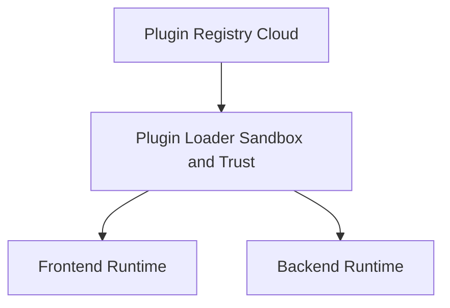

## Überblick

Das Plugin-System von brainz erweitert Frontend und Backend über eine gemeinsame Laufzeit, ein Manifest-basiertes Bereitstellungsmodell und klar getrennte Trust-Levels. Es verbindet die Offenheit von Community-Plugins mit Kontrollmechanismen für Unternehmensumgebungen, damit du Erweiterungen installieren, signieren, einschränken und isoliert ausführen kannst.

Plugins können neue TypeViews, Widgets, Themes, Shortcuts und Quick Actions registrieren, aber auch serverseitige API-Routen, Webhooks, Scheduler, Embedding-Strategien und Pulse-Plugins bereitstellen. Die Ausführung folgt dabei einem mehrstufigen Sicherheitsmodell: offizielle und verifizierte Plugins laufen vertrauenswürdig, Community-Plugins werden im Frontend in Web Workern und im Backend in isolierten Laufzeitkontexten ausgeführt.



<Callout kind="info">

Die zentrale Plugin-Infrastruktur umfasst Registry, Loader, API-Surface, Sandbox, Storage und Marketplace. Frontend- und Backend-Erweiterungen teilen sich dabei dieselbe Manifest- und Lifecycle-Logik.

</Callout>

## Plugin-Typen

Frontend-Plugins erweitern die Benutzeroberfläche und Interaktionen direkt in der App. Backend-Plugins ergänzen Datentypen, Hintergrundverarbeitung und Integrationslogik auf dem Server.

### Frontend-Plugin-Typen

| Typ | Beschreibung |
| --- | --- |
| `typeView` | Neuer ContentType mit Stream-Card und Detailansicht |
| `renderer` | Eigene Detailkarte für bestehende Typen |
| `widget` | UI-Element in Sidebar, Header oder Floating-Surface |
| `theme` | CSS-Override für das Design-System |
| `shortcut` | Tastaturbefehle und Einträge für die Command Palette |
| `quickAction` | Quick-Action-Regeln und Dispatch-Handler |
| `integration-ui` | OAuth-Flow und zugehörige Einstellungsseite |

### Backend-Plugin-Typen

| Typ | Beschreibung |
| --- | --- |
| `contentType` | Neue serverseitige Typdefinition |
| `apiRoute` | REST-Endpunkte unter `/api/plugins/:id/*` |
| `webhook` | Handler für eingehende Webhooks |
| `embedding` | Eigene Strategie zur Embedding-Erzeugung |
| `scheduler` | Cron-basierte Hintergrundaufgaben |
| `pulse` | Prädiktiver oder agentischer Insight-Generator mit Pulse-Charakteren wie `morning`, `resume`, `prep`, `pattern` und `custom` |

## Manifest

Jedes Plugin beschreibt sich selbst über eine Datei namens `brainz-plugin.json`. Das Manifest legt Identität, Kompatibilität, Berechtigungen, Entrypoints und optionale Spezialisierungen wie Quick Actions oder Pulse-Konfiguration fest.

```json
{
  "id": "com.acme.kanban",
  "name": "Kanban Board",
  "version": "1.2.0",
  "brainzApiVersion": "^2.0",
  "types": ["typeView", "quickAction"],
  "permissions": ["content:read", "content:write", "ui:register-views"],
  "description": "Kanban-Ansicht für Aufgaben und Projekte",
  "contentTypes": ["task", "project"],
  "entrypoints": {
    "frontend": "dist/frontend.js",
    "backend": "dist/backend.js",
    "styles": "dist/styles.css"
  },
  "storageScope": "workspace",
  "quickActionRules": [
    {
      "id": "move-to-board",
      "action": "com.acme.kanban:move-to-board",
      "label": "Zu Kanban hinzufügen"
    }
  ],
  "pulse": {
    "character": "custom"
  }
}
```

<Callout kind="info">

Die Validierung des Manifests wird server- und clientseitig durch `plugin-manifest-schema.js` erzwungen. Geprüft werden unter anderem Reverse-Domain-IDs, Semver-Versionen, erlaubte Typen, Berechtigungen und die maximale Anzahl von Quick-Action-Regeln.

</Callout>

### Wichtige Manifest-Felder

<ParamField body="id" param-type="string" required="true" show-location="false">

Eindeutige Plugin-ID im Reverse-Domain-Format, zum Beispiel `com.acme.kanban`.

</ParamField>

<ParamField body="name" param-type="string" required="true" show-location="false">

Anzeigename des Plugins. Der Name ist auf 64 Zeichen begrenzt.

</ParamField>

<ParamField body="version" param-type="string" required="true" show-location="false">

Plugin-Version im Semver-Format.

</ParamField>

<ParamField body="brainzApiVersion" param-type="string" required="true" show-location="false">

Kompatibilitätsbereich zur unterstützten brainz-API-Version.

</ParamField>

<ParamField body="types" param-type="string[]" required="true" show-location="false">

Liste der Plugin-Typen. Mindestens ein Typ ist erforderlich.

</ParamField>

<ParamField body="permissions" param-type="string[]" show-location="false">

Deklarierte Berechtigungen wie `content:read`, `content:write` oder `ui:register-views`. Jeder API-Aufruf wird gegen diese Liste geprüft.

</ParamField>

<ParamField body="entrypoints" param-type="object" show-location="false">

Dateipfade für `frontend`, `backend` und optional `styles`.

</ParamField>

<ParamField body="contentTypes" param-type="string[]" show-location="false">

Optionale Liste der durch das Plugin verwendeten oder erweiterten Content Types.

</ParamField>

<ParamField body="storageScope" param-type="string" enum="user,workspace" show-location="false">

Legt fest, ob Plugin-Daten benutzer- oder arbeitsbereichsweit gespeichert werden.

</ParamField>

<ParamField body="quickActionRules" param-type="object[]" show-location="false">

Regeldefinitionen für Quick Actions. Pro Plugin sind maximal 10 Regeln erlaubt.

</ParamField>

<ParamField body="pulse" param-type="object" show-location="false">

Spezielle Konfiguration für Pulse-Plugins. Dieses Feld ist für Plugins vom Typ `pulse` relevant.

</ParamField>

## Lifecycle

Installation und Ausführung folgen einem festen Ablauf. Ein Plugin wird zuerst registriert, dann aktiviert, bei Bedarf deaktiviert und zuletzt vollständig entfernt.

<Steps>
  <Step title="Installieren" icon="download">

  `installPlugin(manifest)` registriert das Plugin und setzt den Status auf `ready`.

  Nach erfolgreicher Installation wird das Event `plugin:installed` ausgelöst.

  </Step>

  <Step title="Aktivieren" icon="play-circle">

  `enablePlugin(pluginId)` setzt den Status auf `enabled` und führt den Plugin-Code aus.

  Während der Aktivierung registriert das Plugin UI-Erweiterungen, Event-Handler und optionale Backend-Funktionen.

  </Step>

  <Step title="Deaktivieren" icon="minus">

  `disablePlugin(pluginId)` setzt den Status wieder auf `ready`.

  Dabei führt brainz alle gespeicherten Cleanup-Funktionen in LIFO-Reihenfolge aus, damit Registrierungen sauber zurückgebaut werden.

  </Step>

  <Step title="Deinstallieren" icon="trash">

  `uninstallPlugin(pluginId)` entfernt das Plugin aus der Registry.

  Nach der Deinstallation steht das Plugin nicht mehr für automatische Wiederherstellung oder erneute Aktivierung bereit.

  </Step>
</Steps>

Während des Lifecycles sendet das System die Events `plugin:installed`, `plugin:enabled`, `plugin:disabled`, `plugin:uninstalled` und `plugin:error`. Der installierte Zustand wird in `localStorage` unter `brainz:plugins:v1` gespeichert und nach einem Reload automatisch wiederhergestellt.

## Plugin-API

Jedes Plugin erhält ein isoliertes `brainz`-Objekt als API-Surface. Diese API ist auf deklarierte Berechtigungen begrenzt und wird je nach Trust-Level direkt oder über eine Sandbox vermittelt.

### brainz.meta

`brainz.meta` stellt schreibgeschützte Metadaten des aktuell laufenden Plugins bereit.

<ParamField body="brainz.meta.id" param-type="string" show-location="false">

Die Plugin-ID aus dem Manifest.

</ParamField>

<ParamField body="brainz.meta.version" param-type="string" show-location="false">

Die aktive Plugin-Version.

</ParamField>

<ParamField body="brainz.meta.permissions" param-type="string[]" show-location="false">

Die für das Plugin freigegebenen Berechtigungen.

</ParamField>

### brainz.ui

`brainz.ui` registriert UI-Erweiterungen und steuert Interaktionen in der Oberfläche.

<ParamField body="registerTypeView" param-type="function" show-location="false">

Registriert einen neuen TypeView für einen Content Type.

</ParamField>

<ParamField body="registerQuickActions" param-type="function" show-location="false">

Registriert Quick-Action-Regeln und zugehörige Dispatch-Handler.

</ParamField>

<ParamField body="registerHintRule" param-type="function" show-location="false">

Registriert kontextabhängige Hint-Regeln.

</ParamField>

<ParamField body="registerCommand" param-type="function" show-location="false">

Registriert einen Befehl für Tastenkürzel und Command Palette.

</ParamField>

<ParamField body="toast" param-type="function" show-location="false">

Zeigt eine Toast-Benachrichtigung an.

</ParamField>

<ParamField body="haptic" param-type="function" show-location="false">

Löst haptisches Feedback auf unterstützten Geräten aus.

</ParamField>

<ParamField body="openDetail" param-type="function" show-location="false">

Öffnet eine Detailansicht für einen Datensatz.

</ParamField>

<ParamField body="openSettings" param-type="function" show-location="false">

Öffnet eine Plugin- oder System-Einstellungsseite.

</ParamField>

#### TypeView registrieren

```javascript
(function (brainz) {
  brainz.ui.registerTypeView("invoice", {
    label: "Invoices",
    icon: "receipt",
    color: "#4F46E5",
    aliases: ["rechnung"],
    renderStreamCard: function (item, ctx) {
      var el = document.createElement("div");
      el.textContent = item.title + " · " + item.data.status;
      return el;
    },
    renderFullView: function (shell, ctx) {
      shell.innerHTML = "<h2>Rechnung</h2>";
    },
    filters: [
      { key: "open", label: "Offen" },
      { key: "paid", label: "Bezahlt" }
    ],
    onFilter: function (filterKey, state) {
      return filterKey;
    }
  });
})(brainz);
```

#### Command registrieren

```javascript
(function (brainz) {
  brainz.ui.registerCommand({
    id: "open-board",
    label: "Kanban Board öffnen",
    shortcut: "cmd+shift+k",
    handler: function () {
      brainz.ui.toast("Board wird geöffnet", "info", 2500);
      brainz.ui.openSettings("kanban-board");
    }
  });
})(brainz);
```

### brainz.content

`brainz.content` stellt CRUD-Funktionen und Echtzeitabonnements für Inhalte bereit.

<ParamField body="query" param-type="function" show-location="false">

Liest Inhalte anhand von Typ, Filter und Limit.

</ParamField>

<ParamField body="create" param-type="function" show-location="false">

Erstellt einen neuen Eintrag.

</ParamField>

<ParamField body="update" param-type="function" show-location="false">

Aktualisiert einen bestehenden Eintrag.

</ParamField>

<ParamField body="subscribe" param-type="function" show-location="false">

Abonniert Änderungen für angegebene Inhaltstypen.

</ParamField>

### brainz.storage

`brainz.storage` speichert Plugin-Daten in einem isolierten Schlüssel-Wert-Speicher. Der Speicher ist plugin-spezifisch getrennt und kann zusätzlich benutzerspezifische Präferenzen verwalten.

<ParamField body="get" param-type="function" show-location="false">

Liest einen Wert aus dem Plugin-Store.

</ParamField>

<ParamField body="set" param-type="function" show-location="false">

Schreibt einen Wert in den Plugin-Store.

</ParamField>

<ParamField body="delete" param-type="function" show-location="false">

Löscht einen Wert aus dem Plugin-Store.

</ParamField>

<ParamField body="userPrefs.get" param-type="function" show-location="false">

Liest eine benutzerspezifische Präferenz.

</ParamField>

<ParamField body="userPrefs.set" param-type="function" show-location="false">

Schreibt eine benutzerspezifische Präferenz.

</ParamField>

### brainz.events

`brainz.events` verbindet Plugins mit dem Event-Bus von brainz. Eigene Events bleiben namespaced, System-Events werden über eine separate API konsumiert.

<ParamField body="emit" param-type="function" show-location="false">

Sendet ein Plugin-eigenes Event.

</ParamField>

<ParamField body="on" param-type="function" show-location="false">

Registriert einen Listener für Plugin-eigene Events.

</ParamField>

<ParamField body="onBrainz" param-type="function" show-location="false">

Registriert einen Listener für System-Events wie `brainz:item:created`, `brainz:item:updated`, `brainz:item:deleted`, `brainz:search:opened`, `brainz:detail:opened`, `brainz:detail:closed`, `brainz:hint:shown`, `brainz:hint:clicked` und `brainz:hint:dismissed`.

</ParamField>

#### Quick Action registrieren

```javascript
(function (brainz) {
  brainz.ui.registerQuickActions({
    rules: [
      {
        id: "archive-note",
        action: "com.acme.notes:archive-note",
        label: "Archivieren",
        icon: "archive",
        severity: "default",
        contentTypes: ["note"],
        surfaces: ["detail", "stream"],
        when: function (ctx) {
          return ctx.contentType === "note" && ctx.data && ctx.data.archived !== true;
        }
      }
    ],
    dispatch: {
      "archive-note": async function ({ entity, brainz }) {
        await brainz.content.update(entity.type, entity.id, {
          archived: true
        });
        brainz.ui.toast("Notiz archiviert", "success", 2000);
      }
    }
  });
})(brainz);
```

## Server-seitige API

Backend-Plugins erhalten eine eigene API-Surface, die auf Serveroperationen und isolierte Ausführung ausgelegt ist. Alle Zugriffe sind tenant-scoped und folgen denselben Berechtigungs- und Trust-Regeln wie Frontend-Plugins.

<ParamField body="brainz.content.query" param-type="function" show-location="false">

Führt Abfragen auf tenant-spezifischen Inhalten aus.

</ParamField>

<ParamField body="brainz.content.create" param-type="function" show-location="false">

Erstellt serverseitig einen neuen Inhaltseintrag.

</ParamField>

<ParamField body="brainz.content.update" param-type="function" show-location="false">

Aktualisiert bestehende Inhalte serverseitig.

</ParamField>

<ParamField body="brainz.storage.get" param-type="function" show-location="false">

Liest Plugin-Daten aus dem PostgreSQL-KV-Store `app_public.plugin_storage`.

</ParamField>

<ParamField body="brainz.storage.set" param-type="function" show-location="false">

Schreibt Plugin-Daten in `app_public.plugin_storage`.

</ParamField>

<ParamField body="brainz.storage.delete" param-type="function" show-location="false">

Löscht Plugin-Daten aus `app_public.plugin_storage`.

</ParamField>

<ParamField body="brainz.http.fetch" param-type="function" show-location="false">

Führt externe HTTP-Anfragen aus. Für Community-Plugins gilt eine Host-Allowlist.

</ParamField>

<ParamField body="brainz.log.info" param-type="function" show-location="false">

Schreibt strukturierte Informations-Logs.

</ParamField>

<ParamField body="brainz.log.warn" param-type="function" show-location="false">

Schreibt Warnungen in die Plugin-Logs.

</ParamField>

<ParamField body="brainz.log.error" param-type="function" show-location="false">

Schreibt Fehler in die Plugin-Logs.

</ParamField>

<ParamField body="api.mcp" param-type="function" show-location="false">

Nur für Pulse-Plugins verfügbar. Führt einen Tool-Aufruf über einen MCP-Service aus.

</ParamField>

<ParamField body="api.mcpAvailable" param-type="function" show-location="false">

Nur für Pulse-Plugins verfügbar. Prüft, ob ein MCP-Service verfügbar ist.

</ParamField>

## Sandboxing und Sicherheit

Die Sandbox trennt nicht vertrauenswürdige Erweiterungen von der Hauptanwendung. Welche Ausführungsumgebung verwendet wird, hängt vom Trust-Level des Plugins ab.

### Trust-Level-Routing

| Trust-Level | Ausführung | Ermittlung |
| --- | --- | --- |
| `core` | Main Thread ohne Sandbox | Plugin-ID beginnt mit `com.brainz.` |
| `verified` | Main Thread ohne Sandbox | Plugin besitzt `registrySignature` |
| `community` | Web-Worker-Sandbox im Frontend | Alle anderen Plugins |

### Frontend-Sandbox

Community-Plugins laufen in einem dedizierten Web Worker. Dieser Worker hat keinen Zugriff auf `window`, `document` oder andere DOM-APIs, sondern kommuniziert ausschließlich über `postMessage` mit dem Main Thread.

Alle API-Aufrufe werden vor der Ausführung auf Berechtigungen geprüft und über eine Proxy-Schicht weitergeleitet. Für die Initialisierung gilt ein Timeout von 5 Sekunden, für einzelne API-Aufrufe ein Timeout von 10 Sekunden.

### Backend-Sandbox

Backend-Plugins laufen in einem `vm.createContext` mit explizit freigegebenen Globals. Direktzugriffe auf `require`, `process`, `fs`, `global`, `module`, `fetch` und `setTimeout` sind blockiert.

Für CPU-gebundene Ausführung gilt ein Timeout von 5 Sekunden, für asynchrone Vorgänge ein Timeout von 10 Sekunden. Externe HTTP-Antworten sind auf 1 MB begrenzt, und Community-Plugins dürfen nur Ziele auf einer freigegebenen Host-Allowlist ansprechen.

### Berechtigungssystem

Jeder API-Aufruf wird gegen die im Manifest deklarierten Berechtigungen geprüft. Nicht deklarierte Berechtigungen führen zu einem Laufzeitfehler, bevor der eigentliche Aufruf ausgeführt wird.

<Callout kind="alert">

Beispiel für das Fehlermuster bei fehlender Berechtigung:

```text
[brainz/com.example.myplugin] brainz.content.write requires permission "content:write".
Add it to your brainz-plugin.json manifest.
```

</Callout>

### Cleanup

Jede Registrierung über APIs wie `registerTypeView`, `registerQuickAction` oder `registerCommand` erzeugt intern eine Cleanup-Funktion in `_cleanup[]`. Beim Deaktivieren eines Plugins arbeitet brainz diese Funktionen in umgekehrter Reihenfolge ab, damit abhängige Registrierungen konsistent entfernt werden.

## Quick Actions

Quick Actions blenden kontextabhängige Aktionen direkt im Stream oder in Detailansichten ein. Ein Plugin definiert dafür Regeln, die festlegen, wann eine Aktion sichtbar ist, und Dispatch-Handler, die beschreiben, was bei der Ausführung passiert.

Die Regeln werden von `core.quick-actions.evaluateQuickActions()` ausgewertet. Dispatch-Handler laufen innerhalb der jeweiligen Sandbox, und pro Plugin sind höchstens 10 Regeln erlaubt.

### Regelstruktur

<ParamField body="id" param-type="string" show-location="false">

Eindeutige Regel-ID innerhalb des Plugins.

</ParamField>

<ParamField body="action" param-type="string" show-location="false">

Namespaced Action-Key, der Regel und Dispatch-Handler verbindet.

</ParamField>

<ParamField body="label" param-type="string" show-location="false">

Sichtbarer Text der Aktion.

</ParamField>

<ParamField body="icon" param-type="string" show-location="false">

Icon-Name für die Aktion.

</ParamField>

<ParamField body="severity" param-type="string" show-location="false">

Optionale Priorität oder visuelle Gewichtung.

</ParamField>

<ParamField body="when" param-type="function" show-location="false">

Bedingung, die anhand des Kontexts entscheidet, ob die Aktion angezeigt wird.

</ParamField>

<ParamField body="contentTypes" param-type="string[]" show-location="false">

Liste unterstützter Inhaltstypen.

</ParamField>

<ParamField body="surfaces" param-type="string[]" show-location="false">

Oberflächen, in denen die Aktion erscheinen darf, zum Beispiel Detailansicht oder Stream.

</ParamField>

### Beispiel

```javascript
(function (brainz) {
  brainz.ui.registerQuickActions({
    rules: [
      {
        id: "send-to-review",
        action: "com.acme.editorial:send-to-review",
        label: "Zur Prüfung senden",
        icon: "send",
        severity: "default",
        contentTypes: ["draft"],
        surfaces: ["detail"],
        when: function (ctx) {
          return ctx.contentType === "draft" && ctx.data && ctx.data.status === "ready";
        }
      }
    ],
    dispatch: {
      "send-to-review": async function ({ entity, brainz }) {
        await brainz.content.update(entity.type, entity.id, {
          status: "in_review"
        });
        brainz.ui.toast("Entwurf zur Prüfung gesendet", "success", 2500);
      }
    }
  });
})(brainz);
```

## Plugin Store und Marketplace

Der Marketplace stellt Suche, Versionierung, Veröffentlichung und Signierung von Plugins bereit. Registry und Store arbeiten dabei über eine feste REST-API zusammen.

### Registry-API

| Methode | Pfad | Zweck |
| --- | --- | --- |
| `GET` | `/api/registry/plugins?q=&type=&trust=` | Marketplace durchsuchen und filtern |
| `GET` | `/api/registry/plugins/:id` | Plugin-Details und neueste Version laden |
| `GET` | `/api/registry/plugins/:id/versions` | Alle veröffentlichten Versionen abrufen |
| `GET` | `/api/registry/plugins/:id/:version/bundle` | Bundle für eine bestimmte Version herunterladen |
| `POST` | `/api/registry/plugins` | Plugin veröffentlichen, Authentifizierung erforderlich |
| `DELETE` | `/api/registry/plugins/:id/:version` | Version zurückziehen |
| `POST` | `/api/registry/plugins/:id/:version/sign` | Version administrativ verifizieren und signieren |

### Installation

Die Installationspfade unterscheiden sich nur im Einstiegspunkt. Validierung, Registrierung und Aktivierung folgen immer demselben Grundablauf.

<Steps>
  <Step title="Store-UI oder URL verwenden" icon="download">

  brainz lädt das Bundle, extrahiert den Header `BRAINZ_MANIFEST`, validiert das Manifest, installiert das Plugin und aktiviert es anschließend.

  Dieser Pfad wird sowohl für direkte Bundle-URLs als auch für Registry-basierte Installationen verwendet.

  </Step>

  <Step title="Über den Plugin Store installieren" icon="package">

  Der Browse-Tab durchsucht die Registry und bietet One-Click-Installationen an.

  Der Plugin Store lässt sich als Bottom Sheet öffnen. Das zugehörige Tastenkürzel ist <kbd>Shift</kbd> + <kbd>Ctrl</kbd> + <kbd>M</kbd>.

  </Step>

  <Step title="Manuell oder im Dev-Modus laden" icon="terminal">

  Für lokale Entwicklung kannst du die Registry direkt ansprechen und Manifest sowie Code getrennt übergeben.

  ```javascript
  var registry = BrainzModules.require("core.plugin-registry");

  registry.installPlugin({
    id: "com.acme.devtools",
    name: "Dev Tools",
    version: "0.1.0",
    brainzApiVersion: "^2.0",
    types: ["quickAction"],
    permissions: ["content:read"]
  });

  registry.enablePlugin("com.acme.devtools", {
    frontendCode: "(function (brainz) { brainz.ui.toast('Dev plugin aktiv', 'info', 1500); })(brainz);"
  });
  ```

  Wenn die Aktivierung funktioniert, erscheint die Toast-Nachricht und das Plugin wechselt in den Status `enabled`.

  </Step>

  <Step title="Eingebaute Pulse-Plugins automatisch laden" icon="zap">

  Eingebaute Pulse-Plugins aus `plugins/builtin-pulse-*` werden beim Serverstart automatisch geladen.

  Dieser Pfad ist für interne Referenz- und Systemplugins vorgesehen.

  </Step>
</Steps>

### Veröffentlichung

Der Veröffentlichungsfluss beginnt mit dem Build des Plugin-Bundles und endet mit einem versionierten Registry-Eintrag in PostgreSQL. Nach dem Upload validiert der Server Manifest und Bundle, speichert Metadaten und weist dem Plugin zunächst den Trust-Level `community` zu.

Administratoren können eine veröffentlichte Version anschließend signieren und damit auf `verified` hochstufen. Dadurch ändert sich auch das Ausführungsmodell für diese Version.

### Bundle-Anforderungen

| Anforderung | Beschreibung |
| --- | --- |
| Header | Das Bundle muss mit `// BRAINZ_MANIFEST: {JSON}` plus Zeilenumbruch beginnen |
| Integrität | Ein SHA-256-Hash des Bundles wird gespeichert |
| Caching | Versionierte Bundles werden CDN-freundlich und unveränderlich ausgeliefert |

## Ressourcen-Limits

Diese Limits begrenzen Größe und Laufzeit von Plugins, damit Erweiterungen die Anwendungsleistung nicht unverhältnismäßig beeinträchtigen.

| Ressource | Limit |
| --- | --- |
| Frontend JS gzip | 100 KB |
| Frontend CSS gzip | 50 KB |
| Critical Path | 20 KB |
| Backend JS gzip | 200 KB |
| Plugin-scoped KV | 1 GB, konfigurierbar |
| Quick-Action-Regeln pro Plugin | 10 |

## Eingebaute Plugins

Die eingebauten Plugins dienen als Referenzimplementierungen für verschiedene Erweiterungsmuster. Sie decken Pulse-Logik, Quick Actions und TypeViews ab.

| Plugin | Beschreibung |
| --- | --- |
| `builtin-pulse-morning` | Tägliches Morning Briefing |
| `builtin-pulse-pattern` | Wöchentliche oder monatliche Strukturerkenntnisse |
| `builtin-pulse-prep` | Kontinuierliche Hintergrundvorbereitung |
| `builtin-pulse-resume` | Flow-Reaktivierung nach mehr als 2 Stunden Pause |
| `brainz-bring-export` | Exportiert Zutaten aus Rezepten in die Bring-App |
| `brainz-typeview-tasks` | Task-TypeView mit Quick-Complete-Flow |
| `example-readlist` | Persönliche Leseliste als Community-Beispiel |

### Bring-Export als Referenz

Das folgende Beispiel zeigt das Grundmuster eines Quick-Action-Plugins mit Regeldefinition und Dispatch-Handler.

```javascript
// BRAINZ_MANIFEST: {"id":"com.brainz.bring-export","version":"1.0.0"}
(function (brainz) {
  brainz.ui.registerQuickActions({
    rules: [
      {
        id: "bring-export",
        action: "com.brainz.bring-export:bring-export",
        label: "Auf Bring Einkaufsliste",
        icon: "cart",
        contentTypes: ["recipe", "list", "shopping_list"],
        when: function (ctx) {
          return ctx.contentType === "recipe" && ctx.data && ctx.data.ingredients;
        }
      }
    ],
    dispatch: {
      "bring-export": async function ({ entity, brainz }) {
        brainz.ui.toast("Bring wird geladen", "info", 2000);
      }
    }
  });
})(brainz);
```

## Enterprise-Konfiguration

Unternehmensumgebungen können Registries, Trust-Regeln und Update-Strategien zentral steuern. Damit lässt sich das Plugin-System sowohl für offene als auch für streng kontrollierte Bereitstellungen einsetzen.

```yaml
plugins:
  registries:
    - url: https://plugins.internal.acme.com
      auth: bearer-token
      priority: 1
  allowlist:
    - com.brainz.*
    - com.acme.*
  blocklist:
    - com.shady.tracker
  autoUpdate: manual
  sandboxLevel: strict
```

<Callout kind="tip">

Unternehmen können private Registries betreiben und interne Plugins getrennt vom öffentlichen Marketplace ausrollen. In Kombination mit Allowlist, Blocklist und Signierung lässt sich der Plugin-Zugriff präzise steuern.

</Callout>